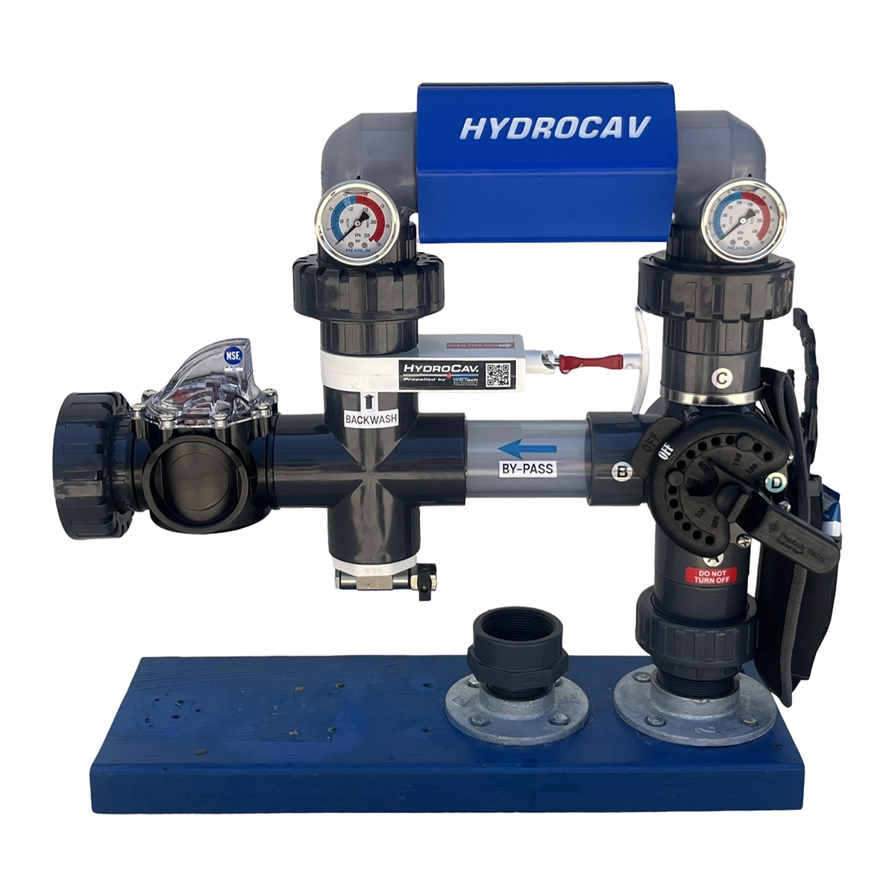

# HydroCav Website: Comprehensive Code Review

**Report by:** Jules
**Date:** 2025-08-11

## 1. Introduction

This document provides a comprehensive code review of the HydroCav website. The review covers the following areas as requested:

-   Design and User Experience (UX)
-   Code Quality (HTML, CSS, JavaScript)
-   Security
-   Accessibility Readiness
-   Browser Compatibility
-   Performance Considerations

The goal of this review is to assess the current state of the codebase and provide actionable recommendations for improvement.

## 2. Design and User Experience (UX) Review

The website presents a modern and visually engaging experience. The "liquid glass" or "glassmorphism" aesthetic is implemented consistently and effectively, creating a cohesive and professional look that aligns well with the water-themed product.

**Strengths:**

*   **Consistent Aesthetic:** The liquid glass design is applied consistently to key interactive elements like buttons, cards, and the navigation bar, creating a unified and polished user interface.
*   **Thematic Cohesion:** The use of a blue and white color palette, combined with the subtle bubble animations, effectively reinforces the "water" and "purity" themes of the HydroCav product.
*   **Clear Navigation:** The single-page layout with a sticky navigation bar and a scroll spy feature (highlighting the active section) makes the site easy to navigate.
*   **Engaging Micro-interactions:** Animations on scroll, the typewriter effect in the hero section, and button hover effects make the site feel dynamic and interactive.
*   **Responsive Design:** The site is designed to be responsive, with a functional mobile menu and content that adapts to different screen sizes.

**Areas for Improvement:**

*   **Navigation Bar Layout Shift:** The logo and navigation links scale significantly on scroll and with screen size changes. This causes the navigation bar's height to change, leading to a noticeable layout shift that can be jarring for the user.
    *   **Recommendation:** Consider a more subtle scaling effect or a fixed height for the navigation bar to prevent layout shifts.
*   **Animation Overload:** While visually impressive, the sheer number of animations (bubbles, scroll-triggered fades, typewriter) could feel overwhelming to some users and may impact performance on less powerful devices. The existing `prefers-reduced-motion` support is excellent, but the default experience could be toned down slightly.
    *   **Recommendation:** Consider reducing the number of bubbles or making some of the scroll-triggered animations more subtle.
*   **Mobile Logo Size:** On mobile devices, the logo in the centered navigation bar is quite large (`3.5rem` to `4rem`), which takes up a significant portion of the vertical screen real estate.
    *   **Recommendation:** Test a slightly smaller logo on mobile to provide more space for content.

## 3. Code Quality Assessment

The overall code quality is high. The code is well-structured, readable, and demonstrates modern development practices.

### 3.1. HTML

**Strengths:**

*   **Semantic HTML:** The document uses semantic tags (`<nav>`, `<main>`, `<section>`, `<footer>`, etc.) correctly, which is good for both SEO and accessibility.
*   **Well-Organized:** The `index.html` file is well-organized with clear comments delineating major sections.
*   **Accessibility in Mind:** The inclusion of a `lang` attribute, `alt` tags for images, and a "skip to main content" link shows attention to accessibility.

**Areas for Improvement:**

*   **Inline JavaScript:** There is a large `<script>` block at the end of the `body` that handles the contact form submission. This includes a `ToastManager` class, validation logic, and the submission handler.
    *   **Recommendation:** Move this entire script into `assets/js/main.js` or a new file (e.g., `assets/js/contact-form.js`) to better separate concerns (HTML for structure, JavaScript for behavior).
*   **Redundant Code:** The function `showLoadingState` is defined twice: once in the inline script and once (commented out) in `main.js`.
    *   **Recommendation:** Remove the duplicated function and consolidate the logic in one place.
*   **Commented-Out Code:** The "Testimonials" section is commented out. While this is fine for temporary disabling, it adds clutter to the file.
    *   **Recommendation:** If this section is not planned for the near future, remove it from the HTML to keep the codebase clean.

### 3.2. CSS

**Strengths:**

*   **Hybrid Approach:** The use of Tailwind CSS (via CDN) for utility classes and a custom stylesheet (`style.css`) for complex components is an effective and maintainable strategy.
*   **Well-Structured:** `style.css` is well-organized with comments and logical sections for different elements and features.
*   **Advanced Techniques:** The CSS demonstrates advanced techniques to achieve the "liquid glass" and animation effects.

**Areas for Improvement:**

*   **Magic Numbers:** The code contains many hard-coded color values (e.g., `rgba(49, 155, 224, 0.7)`).
    *   **Recommendation:** Introduce CSS Custom Properties (variables) for the color palette (e.g., `--hydrocav-primary-blue`, `--hydrocav-light-blue`). This would make the theme much easier to maintain and update.
*   **Selector Specificity:** Some selectors are quite long and could potentially be simplified. For example, `nav.frosted-nav .menu-link`. While not a major issue here, it's a good practice to keep selectors as simple as possible.

### 3.3. JavaScript

**Strengths:**

*   **Excellent Structure:** The `assets/js/main.js` file is exceptionally well-structured, using JavaScript classes (`ScrollSpy`, `TypewriterEffect`, `MobileMenuController`, etc.) to create modular and maintainable components.
*   **Modern Practices:** The code uses modern JavaScript features and best practices, such as `requestAnimationFrame` for smooth animations, passive event listeners for performance, and `try...catch` blocks for error handling.
*   **Readability:** The code is clean, well-commented, and easy to follow.

**Areas for Improvement:**

*   **Code Duplication (with HTML):** As mentioned in the HTML section, the contact form logic should be moved from the inline script in `index.html` to the main JavaScript file to improve organization and maintainability.
*   **Global Scope:** The code attaches instances of the controllers to the `window` object (e.g., `window.heroTypewriter`). While this can be useful for debugging, it pollutes the global namespace.
    *   **Recommendation:** If this is not needed for a specific reason, consider removing this practice. If it is for debugging, it should be removed in a production version of the code.

## 4. Security Analysis

The security posture of the website is generally strong, particularly on the backend. The developers have correctly leveraged Supabase's security features.

**Strengths:**

*   **Correct Supabase Key Exposure:** The use of the public `anon` key on the client-side is the correct and intended practice for Supabase.
*   **Robust Row Level Security (RLS):** The `supabase_setup.sql` file confirms that RLS is enabled on the `contact_submissions` table. The policies are well-configured to only allow anonymous users to `INSERT` data, which is a critical security control.
*   **Server-Side Validation:** The database table has `CHECK` constraints that enforce server-side validation on the length of inputs and the format of the email address. This is an excellent defense against malformed data.
*   **Server-Side Rate Limiting:** The database includes a function (`check_submission_rate_limit`) to limit submission rates per IP address. This is a very effective measure against spam and simple denial-of-service attacks.

**Areas for Improvement:**

*   **Stored Cross-Site Scripting (XSS) Risk:** The application does not appear to sanitize user input to remove potentially malicious HTML (e.g., `<script>` tags). While the server-side validation checks the length of the data, it does not prevent malicious strings from being saved to the database.
    *   **Risk:** If this user-submitted data is ever displayed on an admin dashboard or another part of a web application without being properly escaped, it could lead to a stored XSS attack.
    *   **Recommendation:**
        1.  **Primary:** Ensure that any application that displays this data (e.g., an admin panel) properly escapes it before rendering it in the DOM. For example, use `textContent` instead of `innerHTML`.
        2.  **Secondary:** Consider implementing a sanitization step before inserting the data into the database, for example, using a library like `DOMPurify` on the client-side before submission, or a database function on the server-side.
*   **Missing Subresource Integrity (SRI):** The `<script>` tags used to load Tailwind CSS and Supabase from a CDN do not have the `integrity` attribute.
    *   **Risk:** If the CDN is ever compromised, malicious code could be injected into the site.
    *   **Recommendation:** Generate SRI hashes for the external scripts and add them to the `<script>` tags. For example:
        ```html
        <script src="https://cdn.tailwindcss.com" integrity="sha384-..."></script>
        ```
*   **Missing Security Headers:** The site does not appear to set security headers like `Content-Security-Policy` (CSP) or `X-Frame-Options`.
    *   **Risk:** Lack of a CSP makes the site more vulnerable to XSS attacks. Lack of `X-Frame-Options` makes it vulnerable to clickjacking.
    *   **Recommendation:** Configure the hosting provider to send these headers with all responses. A basic CSP could restrict scripts to be loaded only from the site's own domain and the trusted CDNs.

## 5. Accessibility Readiness Evaluation

The website has a strong foundation for accessibility, with many best practices already implemented. This shows a commendable attention to inclusive design.

**Strengths:**

*   **Semantic HTML:** The correct use of semantic HTML provides a solid structure for screen readers.
*   **Excellent Form Accessibility:** The contact form makes extensive and correct use of `aria` attributes (`aria-required`, `aria-describedby`, `aria-invalid`, etc.) and `label` tags, making it highly accessible.
*   **Keyboard Focus Indicators:** The CSS includes well-defined `:focus-visible` styles, which provide clear visual indicators for keyboard navigators.
*   **Skip Navigation Link:** The "Skip to main content" link is a key feature for users of assistive technology.
*   **Reduced Motion Support:** The implementation of the `prefers-reduced-motion` media query to disable animations is a critical accessibility feature that has been executed well.
*   **Accessible Mobile Menu Button:** The mobile menu button correctly uses `aria-label` and `aria-expanded` to communicate its state to screen readers.

**Areas for Improvement:**

*   **Mobile Menu Focus Trapping:** When the mobile menu is open, focus is not "trapped" within it. A keyboard user can tab "behind" the menu to the content of the main page, which is a confusing and non-standard experience.
    *   **Recommendation:** Implement focus trapping for the mobile menu. When the menu is open, the `Tab` key should cycle through the focusable elements within the menu only. The `Escape` key should close the menu.
*   **Color Contrast:** The "liquid glass" design, with its semi-transparent backgrounds, poses a challenge for color contrast. Some text/background combinations may not meet the WCAG AA minimum contrast ratio of 4.5:1.
    *   **Example:** The white text on the blue navigation buttons (`rgba(49, 155, 224, 0.7)`) can have insufficient contrast depending on the content scrolling behind it.
    *   **Recommendation:** Test all text and background color combinations with a contrast checker tool. Darken the backgrounds or text colors where necessary to meet the minimum contrast ratios. For semi-transparent backgrounds, test them against the lightest and darkest possible content that could appear behind them.
*   **Decorative SVGs:** The SVG icons in the "Advantages" section are decorative. They don't have `<title>` elements, which is good, but they could be explicitly hidden from screen readers.
    *   **Recommendation:** Add `aria-hidden="true"` and `focusable="false"` to the decorative SVG elements to ensure they are skipped by assistive technologies.

## 6. Browser Compatibility Check

The website is clearly designed for modern browsers. It uses several new CSS and JavaScript features that are widely supported in the latest versions of Chrome, Firefox, Safari, and Edge, but will not work in older browsers like Internet Explorer 11.

**Key Feature Analysis:**

*   **CSS `backdrop-filter`:** The core of the "liquid glass" aesthetic relies on this property. It is well-supported in all modern browsers. In browsers that do not support it, the effect will fail gracefully; elements will have a solid or semi-transparent background instead of a blurred one. The site will remain functional.
*   **JavaScript ES6+:** The code uses modern JavaScript syntax, including classes, `const`/`let`, arrow functions, and optional chaining (`?.`). These features are not supported in legacy browsers, and since there is no evidence of a transpilation step (like Babel), the JavaScript would fail to execute in such browsers.
*   **`IntersectionObserver` API:** This API is used for scroll-triggered animations. It is well-supported in modern browsers. In unsupported browsers, the animations will simply not trigger, but the content will still be visible.

**Conclusion:**

The website follows a "modern-first" approach. It will provide the full, intended experience in up-to-date browsers. The development strategy prioritizes a rich experience using modern technologies over backward compatibility with legacy browsers.

**Strengths:**

*   **Graceful Degradation:** For the most part, the site degrades gracefully. The core content and functionality will remain accessible even if the advanced visual effects are not supported.

**Areas for Improvement:**

*   **Lack of Transpilation:** The direct use of modern JavaScript without a build step means the site's functionality could break on slightly older, but still in-use, browser versions that don't support a specific feature like optional chaining.
    *   **Recommendation:** For broader compatibility, consider adding a simple build step using a tool like Babel to transpile the JavaScript to a more widely supported version (e.g., ES2015).
*   **No Feature Queries for CSS:** The CSS does not use `@supports` to check for browser support for features like `backdrop-filter`.
    *   **Recommendation:** While not critical since the failure mode is acceptable, using `@supports (backdrop-filter: blur(10px)) { ... }` could provide a way to offer alternative styling for browsers that don't support the feature, leading to a more intentionally designed fallback experience.

## 7. Performance Considerations Analysis

The website's performance is a key area with significant opportunities for improvement. While the site feels relatively snappy due to modern hardware and fast connections, several optimizations could enhance the user experience, especially for users on slower networks or less powerful devices.

**Strengths:**

*   **Modern Image Formats:** The use of the `.webp` image format is an excellent choice for reducing image file sizes.
*   **Performant Animations:** The use of `IntersectionObserver` for scroll-triggered animations is much more performant than attaching listeners directly to the `scroll` event.
*   **Optimized Scroll Listeners:** The scroll listener for the progress bar is debounced using `requestAnimationFrame`, which is a best practice.

**Areas for Improvement:**

*   **Un-purged Tailwind CSS:** The site loads the entire Tailwind CSS library from the CDN. This file can be very large, and the vast majority of its styles are likely unused.
    *   **Recommendation:** Set up a build process (e.g., using the Tailwind CLI) to scan the HTML and JavaScript files and "purge" all unused CSS classes. This would dramatically reduce the size of the CSS file, leading to a faster Largest Contentful Paint (LCP).
*   **Render-Blocking Scripts:** The `<script>` tags in the `<head>` and at the end of the `<body>` are not loaded with `defer` or `async`. This means they block the rendering of the page while they are being downloaded and executed.
    *   **Recommendation:** Add the `defer` attribute to the `<script>` tags (`<script src="..." defer>`). This will cause the scripts to be downloaded in parallel with the page rendering and executed only after the document has been parsed.
*   **Non-Responsive Images:** The "Product Showcase" section loads a `1200px`-wide image regardless of the screen size. While different sizes of the image exist in the repository (`400px`, `800px`), they are not being used.
    *   **Recommendation:** Use the `<picture>` element or the `srcset` attribute to implement responsive images. This would allow the browser to download a smaller image on mobile devices, improving load times.
      ```html
      <picture>
        <source media="(max-width: 600px)" srcset="assets/images/HydroLoop_400px.webp">
        <source media="(max-width: 900px)" srcset="assets/images/HydroLoop_800px.webp">
        
      </picture>
      ```
*   **Cumulative Layout Shift (CLS):** As mentioned in the UX review, the scaling navigation bar causes a significant layout shift, which negatively impacts the CLS Core Web Vital.
    *   **Recommendation:** Give the navigation bar a fixed height to prevent its size changes from pushing down the content of the page.
*   **Animation Performance:** The combination of `backdrop-filter`, multiple `box-shadow` properties, and numerous animating bubbles can be GPU and CPU-intensive.
    *   **Recommendation:** While the `prefers-reduced-motion` query is a great fallback, consider slightly reducing the number of bubbles in the default view or simplifying some of the `box-shadow` effects to ensure a smooth experience on all devices.

## 8. Summary and Recommendations

Overall, the HydroCav website is a high-quality, modern, and visually impressive single-page application. The code is well-structured, and it's clear that attention has been paid to modern development practices, user experience, and security. The recommendations below are intended to build upon this strong foundation to further enhance the site's performance, security, and accessibility.

### Prioritized Recommendations

#### High Priority (Immediate Impact)

1.  **Fix Cumulative Layout Shift (CLS):**
    *   **Issue:** The scaling navigation bar causes a significant layout shift.
    *   **Action:** Give the navigation bar a fixed height to prevent it from resizing and pushing down the page content. This will improve a key Core Web Vital.
2.  **Purge Unused CSS:**
    *   **Issue:** The site loads the entire Tailwind CSS library, which is detrimental to performance.
    *   **Action:** Implement a build step with Tailwind CLI to purge unused styles. This is the single most impactful performance optimization available for this site.
3.  **Mitigate Stored XSS Risk:**
    *   **Issue:** User input from the contact form is not sanitized, creating a stored XSS risk.
    *   **Action:** While the backend RLS is strong, ensure that any admin application that displays this data escapes it properly before rendering. Using `textContent` instead of `innerHTML` is a good first step.

#### Medium Priority (Important Improvements)

1.  **Implement Mobile Menu Focus Trapping:**
    *   **Issue:** Keyboard users can tab "behind" the open mobile menu.
    *   **Action:** Add JavaScript logic to trap focus within the mobile menu when it is active.
2.  **Refactor Inline JavaScript:**
    *   **Issue:** The contact form logic resides in a large inline `<script>` tag in `index.html`.
    *   **Action:** Move all JavaScript from `index.html` into `assets/js/main.js` or a dedicated file to improve code organization and maintainability.
3.  **Add Subresource Integrity (SRI):**
    *   **Issue:** External scripts are loaded without integrity hashes.
    *   **Action:** Generate SRI hashes for the Tailwind and Supabase scripts and add them to the `<script>` tags to enhance security.
4.  **Implement Responsive Images:**
    *   **Issue:** The site loads large images on all screen sizes.
    *   **Action:** Use the `<picture>` element or `srcset` to serve smaller, appropriately-sized images to mobile devices.

#### Low Priority (Best Practices and Polish)

1.  **Adopt CSS Variables:**
    *   **Issue:** Colors and other values are hard-coded in the CSS.
    *   **Action:** Refactor the CSS to use custom properties (variables) for the color palette to make the theme easier to maintain.
2.  **Improve SVG Accessibility:**
    *   **Issue:** Decorative SVGs are not explicitly hidden from assistive technologies.
    *   **Action:** Add `aria-hidden="true"` and `focusable="false"` to the decorative SVG icons.
3.  **Add `defer` to Scripts:**
    *   **Issue:** Scripts are not loaded asynchronously.
    *   **Action:** Add the `defer` attribute to all `<script>` tags to prevent render-blocking.
