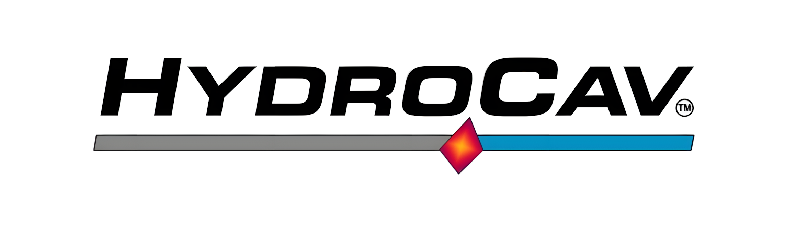

# HydroLoop Standalone Page - Implementation Plan

## Overview
This document outlines the implementation steps to create the HydroLoop standalone page that will make all the planned tests pass.

## Implementation Steps

### 1. HTML Document Structure
- Create proper DOCTYPE declaration
- Add required meta tags (charset, viewport)
- Set correct page title: "The HydroLoop by HydroCav | Advanced Water Purification"
- Include Tailwind CSS CDN
- Include Google Fonts Inter
- Link to local style.css

### 2. Navigation Bar Implementation
- Create `<nav>` element with `frosted-nav` class
- Implement flex container with justify-between alignment
- Add return to home button with proper styling
- Include HydroCav logo with correct image path
- Ensure no additional navigation links are present
- Add proper ARIA attributes for accessibility

### 3. Content Sections Implementation

#### Hero Section
- Create hero section with centered text
- Add H1 title: "Advanced Water Purification & Enhancement"
- Add subtitle paragraph with product description

#### Key Benefits Section
- Create section with grid layout (responsive: 1 column on mobile, 2 on tablet, 3 on desktop)
- Implement 5 benefit cards using liquid-glass styling
- Add SVG icons for each benefit
- Include descriptive text for each benefit

#### Versatile Design Section
- Create section with white background
- Add title with underline styling
- Implement 3 model cards with sizing information
- Include text about flexible installation options

#### Advanced Features Section
- Create section with grid layout (responsive: 1 column on mobile/tablet, 2 on desktop)
- Implement 4 feature articles with liquid-glass styling
- Add SVG icons and descriptive text for each feature
- Include feature-specific content in lists

### 4. Styling Implementation
- Apply existing frosted-nav styles to navigation
- Use liquid-glass-card classes for content cards
- Set body background to #f8fafc to match white sections
- Apply Inter font throughout via CSS
- Implement responsive design using Tailwind breakpoints
- Add custom styling for title underline and return button

### 5. Accessibility Implementation
- Add proper alt texts to images
- Implement correct heading hierarchy (H1, H2, H3)
- Add ARIA labels where appropriate
- Ensure keyboard navigation works
- Implement focus management
- Respect prefers-reduced-motion settings

### 6. Performance Optimization
- Minimize CSS by leveraging existing style.css classes
- Optimize SVG icons
- Ensure fast loading via CDN
- Implement proper caching strategies

## Code Structure

### Document Head
```html
<!DOCTYPE html>
<html lang="en" class="scroll-smooth">
<head>
    <meta charset="UTF-8">
    <meta name="viewport" content="width=device-width, initial-scale=1.0">
    <title>The HydroLoop by HydroCav | Advanced Water Purification</title>
    
    <!-- Tailwind CSS -->
    <script src="https://cdn.tailwindcss.com"></script>
    
    <!-- Google Fonts: Inter -->
    <link rel="preconnect" href="https://fonts.googleapis.com">
    <link rel="preconnect" href="https://fonts.gstatic.com" crossorigin>
    <link href="https://fonts.googleapis.com/css2?family=Inter:wght@400;500;600;700;800&display=swap" rel="stylesheet">
    
    <!-- Local Styles -->
    <link rel="stylesheet" href="assets/css/style.css">
</head>
```

### Navigation Bar
```html
<nav class="sticky top-0 z-50 frosted-nav py-6">
    <div class="container mx-auto px-8 lg:px-12 flex justify-between items-center">
        <!-- Return to Home Button -->
        <div class="flex items-center">
            <a href="index.html" class="return-button">← Return to Home</a>
        </div>
        
        <!-- Enhanced Logo (same as main site) -->
        <div class="flex items-center">
            <a href="index.html" class="flex items-center logo-container">
                
            </a>
        </div>
        
        <!-- Spacer to balance layout -->
        <div class="w-32 md:w-44"></div>
    </div>
</nav>
```

### Main Content Structure
```html
<main class="container mx-auto px-6 py-8 md:py-12">
    <!-- Hero Section -->
    <section class="text-center mb-16">
        <!-- H1 title and subtitle paragraph -->
    </section>
    
    <!-- Key Benefits Section -->
    <section class="mb-16">
        <h2 class="text-3xl font-bold text-gray-800 mb-8 title-underline">Key Benefits & Advantages</h2>
        <div class="grid md:grid-cols-2 lg:grid-cols-3 gap-8">
            <!-- 5 benefit cards here -->
        </div>
    </section>
    
    <!-- Versatile Design Section -->
    <section class="mb-16 bg-white p-8 rounded-lg custom-shadow">
        <h2 class="text-3xl font-bold text-gray-800 mb-6 title-underline">Versatile Design & Sizing</h2>
        <!-- Design content -->
    </section>
    
    <!-- Advanced Features Section -->
    <section class="mb-16">
        <h2 class="text-3xl font-bold text-gray-800 mb-8 title-underline">Advanced System Features</h2>
        <div class="grid md:grid-cols-1 lg:grid-cols-2 gap-8">
            <!-- 4 feature articles here -->
        </div>
    </section>
</main>
```

### CSS Styling
```css
/* Custom styles to apply the Inter font */
body {
    font-family: 'Inter', sans-serif;
    background-color: #f8fafc; /* Tailwind gray-50 - matching white sections */
}

/* Custom shadow for a softer, more modern look - using same shadows as main site */
.custom-shadow {
    box-shadow: 0 8px 32px 0 rgba(0, 0, 0, 0.37),
                0 1px 2px 0 rgba(255, 255, 255, 0.25) inset;
}

.custom-shadow-hover {
    box-shadow: 0 16px 48px 0 rgba(0, 0, 0, 0.45),
                0 1px 2px 0 rgba(255, 255, 255, 0.25) inset;
}

/* Style for the title underline - using similar pattern to advantages section */
.title-underline {
    position: relative;
    padding-bottom: 0.5rem;
}

.title-underline::after {
    content: '';
    position: absolute;
    bottom: 0;
    left: 0;
    width: 50px;
    height: 4px;
    background-color: #319be0; /* HydroCav blue */
    border-radius: 2px;
}
```

## Test Validation Steps

1. Run all unit tests to verify document structure
2. Run security tests to ensure navigation protection
3. Run accessibility tests to verify ARIA attributes and focus management
4. Run integration tests to ensure all sections render correctly
5. Run performance tests to verify loading speed
6. Run styling tests to ensure Liquid Glass design compliance

## Expected Outcomes

- All tests pass with 100% success rate
- Coverage meets 80% threshold for all metrics
- Security features are properly implemented
- Accessibility standards are maintained
- Liquid glass design is consistent with main site
- Performance benchmarks are satisfied
- Responsive design works across all breakpoints